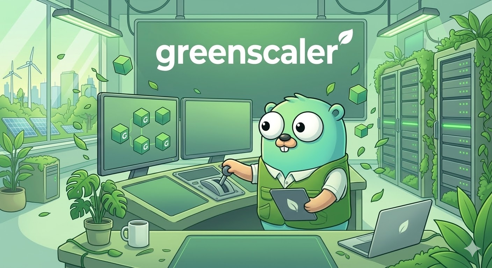

## For developer

CRD Example:

```Yaml
apiVersion: scaling.example.com/v1
kind: CronScaler
metadata:
  name: scale-down-at-night
spec:
  targetRef:
    kind: Deployment
    name: my-app
    namespace: default
  timezone: "Europe/Moscow"
  rules:
    - schedule: "0 20 * * *"   # 20:00 every day
      replicas: 1
    - schedule: "0 8 * * 1-5"   # 8:00 on weekdays
      replicas: 10
```

### 1. Install utilities

- kubebuilder

```
go install sigs.k8s.io/controller-runtime/tools/setup-envtest@latest

kubebuilder init --domain example.com --repo github.com/morheus9/GreenScaler-Operator
kubebuilder create api --group app --version v1alpha1 --kind GreenScalerService --resource --controller
```

- controller-gen

```
make controller-gen
GOBIN=/home/pi/go/bin go install sigs.k8s.io/controller-tools/cmd/controller-gen@latest
```

- kustomize

```
make kustomize
sudo apt install kustomize
```

### 2. Code generation

##### Generates code based on markers in types.go

```
make generate
```

##### Generates CRD, RBAC, Webhook manifests

```
make manifests
```

### 3. Build

```
make build
```

### 4. Installing in cluster

```
make install
```

### 5. Start in development mode

```
make run
```

##### Checking

```
kubectl get crd | grep
```

PS

```
make generate
make manifests
make build

make install
make deploy IMG=morheus/GreenScaler-operator:0.0.1
kubectl apply -k config/samples/

make uninstall
make undeploy IMG=morheus/GreenScaler-operator:0.0.1
kubectl apply -k config/samples/
```
